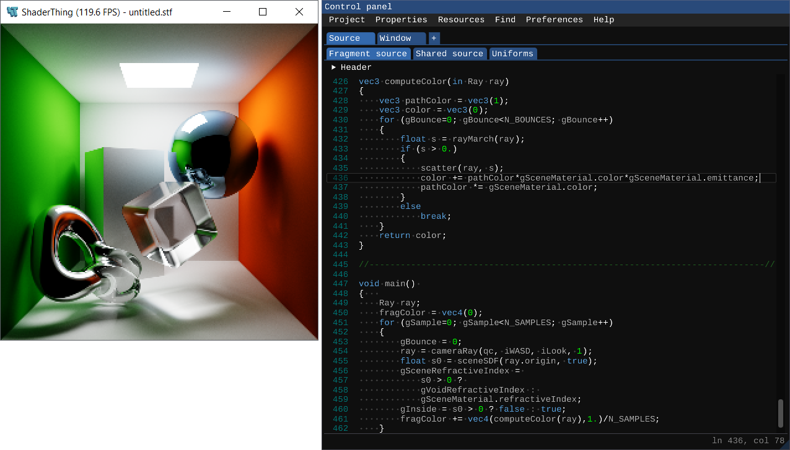
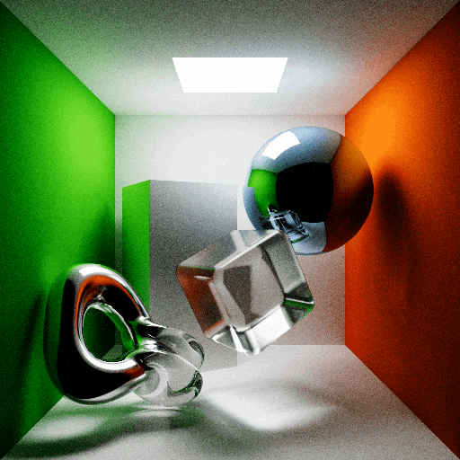

# ShaderThing  

ShaderThing is a cross-platform GUI-based tool for live [GLSL](https://www.khronos.org/opengl/wiki/Core_Language_(GLSL)) shader editing written in C++, leveraging [OpenGL](https://www.opengl.org/) for graphics and [ImGui](https://github.com/ocornut/imgui) for the UI. It can be thought of as a (much) more flexible and capable off-line version of [Shadertoy](https://www.shadertoy.com/), featuring:

* Layer-based shader system: each shader consists of a layer, which can render its content to:
    * the main window, with support for multiple layers rendering to the screen at the same time and transparency-based merging and blending;
    * its own framebuffer, which can be further manipulated by other layers.
* Live shader uniform editor with mouse/keyboard input support: click and drag to set floats, vectors, textures, cube-maps, pick colors and more!
* Live shader storage in the form of a shared SSBO coupled with a custom data viewer: store and inspect any shader quantity in real-time (very useful for, but not limited to, debugging purposes)
* Resource manager: load your own textures, manage framebuffer-rendered layers and generate cube-maps.
* Exporter: export static images, GIFs or video frames (to be packaged into videos by your third-party software of choice) with a variety of output rendering controls.
* Built-in high-performance compute-shader-based post-processing effects: K-Means color quantizer with optional dithering and live palette editor; bloom effect based on [industry-proven approaches](https://www.iryoku.com/next-generation-post-processing-in-call-of-duty-advanced-warfare/); two-pass sub-pixel-stepped gaussian blur effect.
* Built-in library of useful GLSL code snippets!

Compared to Shadertoy, some features are currently missing, primarily sound input/output-related as well as 3D-texture uniforms, though support for these will probably be added at some point in the future. 

Whether you are merely curious about or already have solid skills in the field of shaders, give it a try! Both the source code and the [executables](https://github.com/virmodoetiae/shaderthing/releases/) are distributed under a permissive modified [zlib/linpng license](https://opensource.org/license/zlib/).

# Gallery

<figure style="margin-left: 0px;margin-right:0px">
  
</figure>

***Figure 1:*** *Example of a Monte Carlo-based light transport simulation of a scene described by a signed distance field, written in and rendered with ShaderThing. The application consists of: 1) the main rendering window on the left and 2) the ShaderThing GUI window on the right, allowing for (but not limited to): writing and compiling the actual GLSL shader code, manipulating shader uniforms, loading images/textures or animated GIFs as resources for use with shaders, exporting the rendered view as either static (.png) or animated (.gif) images, and more!*

<figure style="margin-left: 0px;margin-right:0px">
  
</figure>

***Figure 2:*** *Monte Carlo-based light transport simulation of a scene described by a time-dependent signed distance field, written in and rendered with ShaderThing. This GIF has been created directly by ShaderThing, and it consists of 25 frames of a resolution of 512 x 512 pixels, rendered with 4096 photons per pixel per frame. The overall rendering and export duration was 7 minutes and 15 seconds on an Nvidia GTX 1080 Ti graphics card. The animation noise is due to the relatively small photon count of the simulation.*

# Requirements for running

ShaderThing requires a GPU supporting at least **OpenGL v3.3**, which is the case for virtually all consumer GPUs built since its release in 2010. Please consider, howerever, that OpenGL v4.3 or greater is required in order to use the GIF exporter tool or any of the layer post-processing effects, since these are all based on [compute shaders](https://www.khronos.org/opengl/wiki/Compute_Shader). If a version of OpenGL greater than or equal to 4.3 is not available, said features will be disabled without affecting any other functionality.

While ShaderThing runs on OpenGL, it does not directly deal with OpenGL code, but leverages a custom-written rundimentary graphics engine (the 'vir' library). It is the latter that deals with OpenGL, yet is structured in a way to (hopefully) enable the addition of further graphics APIs (e.g. Vulkan, though no such plans exist for now) in the future.

# Repository structure

This repository consists of:
* the top-level ShaderThing app (in shaderthing/);
* the vir library (a higher-level wrapper for graphics, window & input management, in vir/);
* a collection of third-party libraries (ranging from [GLFW](https://www.glfw.org/) to ImGui), compiled into a single one.

The vir and third-party libraries are statically linked to the final ShaderThing executable, making it stand-alone (except for the OpenGL library, which typically requires no special attention and is located automatically).

# How to compile

The code base (ShaderThing-proper and the vir library) and related third-party libraries are cross-platform and *should* compile on most platforms. Compilation on Windows 10 (Windows 10 Pro, build 19045) and Ubuntu 24.04 LTS (running on [WSL](https://ubuntu.com/desktop/wsl)) has been tested so far with the GNU GCC compiler (v12.2.0 for Windows, via [MinGW](https://www.mingw-w64.org/)). Regardless of the platform, the intended compilation approach is via [cmake](https://cmake.org). 

## On Windows 10

From within the root of this repository, from a terminal or PowerShell, run:

~~~
cmake -S shaderthing/ -B shaderthing/build -DCMAKE_BUILD_TYPE=Release
~~~

Depending on your cmake configuration (see [cmake-generators](https://cmake.org/cmake/help/latest/manual/cmake-generators.7.html)), if you intend to use a MinGW-bundled GNU GCC compiler, it may be necessary to specify the MinGW generator (only if the previous command returns any generator-related errors) by running:

~~~
cmake -S shaderthing/ -B shaderthing/build -DCMAKE_BUILD_TYPE=Release -G "MinGW Makefiles"
~~~

Once the build files have been built, compile the project by running:

~~~
cmake --build shaderthing/build --parallel N
~~~

Replace N with the desired number of cores to be used for the compilation. On reasonably modern hardware, it should take about a minute on 4 cores. The executable will then be located in shaderthing/build/shaderthing.exe.

## On Linux-based systems

The procedure is exactly the same as on Windows 10, tested on Ubuntu 24.04 LTS running on WSL.
